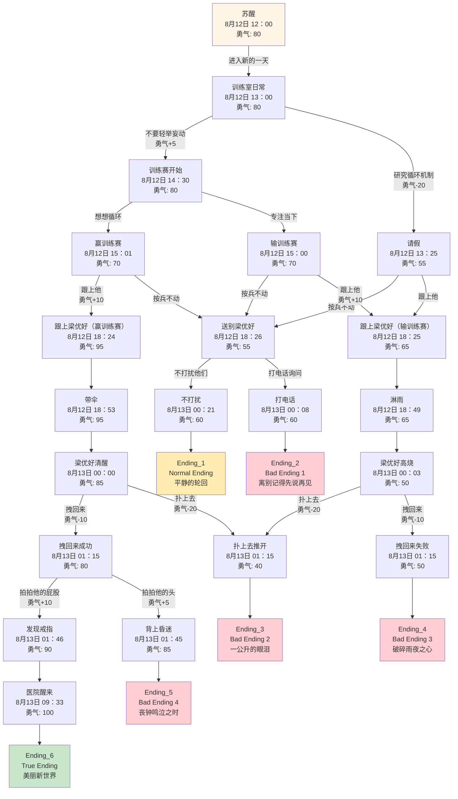

# 自新世界 - 游戏流程图

## 完整流程结构

## 节点详细信息

### 起始节点
- **Node_100 - 意识到循环**: 游戏开始，意识到陷入时间循环
  - 时间: ??月??日 ??：??
  - 初始勇气: 80
  - 节点内勇气变化: 无

### 主要分支路径

#### 路径A：正常训练路线
1. **Node_200 - 训练室日常** (8月12日 13：00, 初始勇气: 80)
   - 节点内勇气变化: 发现张柏霖迟疑 -5
   - 选择：不要轻举妄动 (勇气+5) → **Node_300**
   - 或：研究循环机制 (勇气-20) → **Node_301**

2. **Node_300 - 训练赛开始** (8月12日 14：30, 初始勇气: 80)
   - 节点内勇气变化: 听见张柏霖叹气 -20, 和张柏霖击拳 +10 (净变化: -10)
   - 专注当下 → **Node_401** (8月12日 15：00, 初始勇气: 70)
   - 想想循环 → **Node_400** (8月12日 15：01, 初始勇气: 70) - 利用循环知识赢得训练赛

3. **Node_400 - 利用循环赢比赛** (8月12日 15：01, 初始勇气: 70)
   - 节点内勇气变化: 赢得比赛 +20, 注意张柏霖到心虚摸鼻子 -5 (净变化: +15)
   - 跟上他 (勇气+10) → **Node_500** (初始勇气: 95)
   - 按兵不动 → **Node_502**

4. **Node_401 - 专注比赛失败** (8月12日 15：00, 初始勇气: 70)
   - 节点内勇气变化: 看到张柏霖想离开训练室 -10, 训练室沉闷 -5 (净变化: -15)
   - 跟上他 (勇气+10) → **Node_501**
   - 按兵不动 → **Node_502**

#### 路径B：研究循环路线
1. **Node_301 - 请假研究** (8月12日 13：25, 初始勇气: 55)
   - 节点内勇气变化: 察觉到张柏霖心情不好 -10
   - 跟上他 → **Node_501** (8月12日 18：25, 初始勇气: 65)
   - 按兵不动 → **Node_502** (8月12日 18：26, 初始勇气: 55)

### 关键决策点

#### 18:24-18:26 时间点
- **Node_500 - 跟上梁优好(胜利)** (18:24, 初始勇气: 95)
  - 节点内勇气变化: 无

- **Node_501 - 跟上梁优好(研究)** (18:25, 初始勇气: 65)
  - 节点内勇气变化: 无

- **Node_502 - 送别梁优好** (18:26, 初始勇气: 55)
  - 节点内勇气变化: 张柏霖来送别 +5
  - 不打扰 → **Node_900** (初始勇气: 60) → Ending_1 (Normal Ending)
  - 打电话 → **Node_901** (初始勇气: 60) → Ending_2 (Bad Ending 1)

#### 餐厅/夜晚路线
- **Node_600 - 淋雨路线** (18:49, 初始勇气: 65)
  - 节点内勇气变化: 张柏霖淋雨 -5, 和王磊对话 -10 (净变化: -15)

- **Node_601 - 带伞路线** (18:53, 初始勇气: 95)
  - 节点内勇气变化: 和王磊对话 -10

- **Node_610 - 借伞路线** (00:03, 初始勇气: 50)
  - 节点内勇气变化: "就在前面" +10

- **Node_611 - 手机没电路线** (00:00, 初始勇气: 85)
  - 节点内勇气变化: "我来带路" +5

### 最终危机节点 (01:15)

#### 车祸场景
- **Node_700 - 扑上去推开** (01:15, 初始勇气: 40)
  - 节点内勇气变化: 无
  - → Ending_3 (Bad Ending 2: 一公升的眼泪)
  
- **Node_701 - 拽回来失败** (01:15, 初始勇气: 50)
  - 节点内勇气变化: 无
  - → Ending_4 (Bad Ending 3: 破碎雨夜之心)
  
- **Node_702 - 拽回来成功** (01:15, 初始勇气: 80)
  - 节点内勇气变化: 无
  - 拍拍他的屁股 (勇气+10) → **Node_800** (初始勇气: 90) → True Ending路线
  - 拍拍他的头 (勇气+5) → **Node_801** (初始勇气: 85) → Ending_5 (Bad Ending 4)

- **Node_800 - 发现戒指** (01:46, 初始勇气: 90)
  - 节点内勇气变化: 拒绝被张柏霖背 +10
  - → **Node_TRUE_END** (初始勇气: 100)

- **Node_801 - 拍拍头** (01:45, 初始勇气: 85)
  - 节点内勇气变化: 无
  - → Ending_5 (Bad Ending 4)

- **Node_900 - 不打扰** (00:21, 初始勇气: 60)
  - 节点内勇气变化: 无
  - → Ending_1 (Normal Ending)

- **Node_901 - 打电话** (00:08, 初始勇气: 60)
  - 节点内勇气变化: 无
  - → Ending_2 (Bad Ending 1)

- **Node_TRUE_END - 医院醒来** (??月??日 ??：??, 初始勇气: 100)
  - 节点内勇气变化: 无
  - → Ending_6 (True Ending)